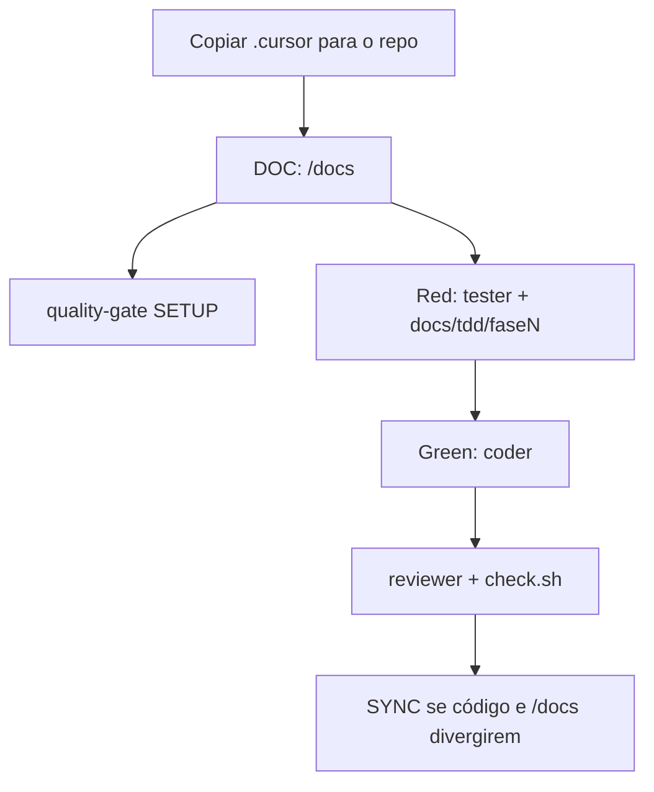

# Leonardo Dev Toolkit

> *«O código é o produto residual da teoria da construção do projeto.»*  
> — frase adaptada de Peter Naur

Kit de **skills**, **rules**, **agents** e **hooks** para o [Cursor](https://cursor.com): o agente trabalha a partir de uma spec escrita, em fatias TDD, com um quality gate na máquina — não a partir de “best practices” genéricas.

Isto **não** é uma aplicação. É o contexto que se copia para um repositório novo (ou legado) para o agente ter as mesmas regras desde o primeiro commit.

O kit canónico está em [`.cursor/`](.cursor/). Templates de spec antiga (legado) estão em [`docs/harness/`](docs/harness/).

---

## Para que serve

Dar ao agente um **contrato de trabalho** fechado:

1. **O que construir** fica em `/docs` (spec one-shot: brief, arquitectura, modelos, features, contratos).
2. **Como construir** fica em `docs/tdd/fase{N}.md` + `fase{N}Task.md` (ondas TDD: Red → Green → Refactor).
3. **Quem faz o quê** são agents com papel único (`project`, `tester`, `coder`, `reviewer`, …).
4. **O que não pode passar** é o quality gate (Lefthook + linters na máquina, não como dependência do projeto).

Sem isso, o modelo inventa arquitectura, mistura testes com código de produção, altera testes antigos e “completa” features que o utilizador não pediu.

---

## Filosofia

**A spec vence.** Se `/docs` existe, é a fonte de verdade. Código deriva da spec — nunca o contrário. Ambiguidade na spec vira bug no output.

**Unidade de desenho = operação nomeada** (`create_user`, `list_orders`, `approve_payment`): command, query ou job. Não MVC, não camadas `domain/` / `infra/` / `usecase/`, não Clean/Hexagonal/DDD/CQRS por defeito.

**Barato de mudar.** Monólito modular, Transaction Script ou pipeline curto, funções, schema-first, SQL/query object local. Abstract só com duplicação real, caminho principal mais curto, melhor localidade e risco menor.

**Docs antes de código.** Feature nova exige `docs/03-features/feature-{name}.md` com as **4 respostas do utilizador** (o agente não as inventa). Sem isso, a feature não entra.

**TDD em ondas.** Red (`tester`) escreve testes a falhar e o handoff `fase{N}*`. Green (`coder`) só implementa esse checklist. Sem handoff Red, não há Green. Testes já no repo não se apagam nem se reescrevem.

**Gate na máquina.** Ruff, mypy, Bandit, pip-audit, vulture, golangci-lint, Biome, Lefthook e Gitleaks instalam-se no PATH do programador — não no `pyproject.toml` / `package.json` / `go.mod`. Complexidade ciclomática (radon / cyclop) **só relata**; não barra commit.

**Graphify primeiro.** Antes de inferir arquitectura ou “onde isto vive”, consultar `graphify-out/` (ou perguntar se o grafo não existe).

**Menos tokens, menos teatro.** Agent/Ask fazem só o pedido. Plan mode raciocina. Sem `.env` editado pelo agente (só `.env.example`). Payloads para LLM em TOON.

---

## Como usar

Fluxo típico num projeto novo:



| Pedido seu | O que o agente deve fazer |
|-------------|---------------------------|
| Documentar / planear o produto | Agent `project` + skill `documentation-harness` **DOC** (alias `harness-create`). Spec em `/docs`. **Não** criar `docs/harness/` em bootstrap novo. |
| Gerar a app a partir da spec | `documentation-harness` **BUILD**: uma fase de cada vez. Red → handoff → Green → Refactor → Verify. |
| Código e `/docs` desalinhados | **SYNC** (hook `stop` também avisa se `docs/00-brief.md` existe). |
| Legado sem `/docs` | `legacy-explainer` (Graphify), depois DOC. |
| Review do diff | Agent `reviewer`: `.cursor/skills/quality-gate/scripts/check.sh` (check-only, sem `--fix`, sem `lefthook install`). |
| Comentários | Agent `commenter` (pt-BR, só o que acrescenta intenção). |
| Refactor sem mudar comportamento | Agent `refactor`. |
| Segurança explorável | Agent `security`. |
| Validar contra a spec | Agent `validator`. |

Peça **Red** ou **Green** de forma explícita. O `tester` não escreve código de produção; o `coder` não escreve testes.

### Spec (`/docs`)

| Ficheiro | Função |
|----------|--------|
| `00-brief.md` | Objectivo, stack, non-goals |
| `01-architecture.md` | Operações, árvore, consistência |
| `02-data-models.md` | Modelos |
| `03-features/feature-{name}.md` | Uma feature = 4 respostas suas + operações |
| `04-contracts.md` | Contratos de API |
| `05-non-negotiables.md` | Convenções, testes, gate |
| `06-discretion.md` | Decisões pequenas |
| `CHANGELOG.md` | Ledger |

Implementação: `docs/tdd/fase{N}.md` + `fase{N}Task.md`. Catálogo de testes: `docs/testsReadme.md`.

Projetos **já** em `docs/harness/` continuam a ligar a essa pasta (legado). Bootstrap novo é só `/docs`.

### Agents (`.cursor/agents/`)

| Agent | Papel |
|-------|--------|
| `project` | Bootstrap: spec, scaffold de stack, kit, quality-gate SETUP. Não implementa produto. |
| `tester` | Red, verify, cobertura. Só testes novos. |
| `coder` | Green a partir do handoff. Só código de produção. |
| `refactor` | Sem mudança de comportamento observável. |
| `reviewer` | Audit estático + checklist. Não edita. |
| `commenter` | Comentários / docstrings. |
| `validator` | Gate da spec (read-only). |
| `security` | Vulnerabilidades exploráveis. |

### Skills centrais (`.cursor/skills/`)

| Skill | Quando |
|-------|--------|
| `documentation-harness` | DOC / BUILD / SYNC |
| `harness-create` | Alias de DOC |
| `default-architecture` | Forma do sistema (operações, monólito) |
| `quality-gate` | SETUP (CLIs na máquina) e RUN (`check.sh`) |
| `tester` | Matriz TDD e handoff `fase{N}*` |
| `get-my-tools` | Instalar pedaços deste kit noutro repo |

Há skills de stack (`django-project`, `nest-project`, `laravel-project`, …), Graphify (`legacy-explainer`, `cistina-arch`), e domínio (Shopify, WordPress, guardsman). O agente só as usa se o pedido corresponder.

### Rules (`.cursor/rules/`)

Sempre ativas no Cursor. As que definem o contrato: `docs-pointer`, `all-for-harness`, `default-architecture`, `graphify-first`, `persisted-tester`, `less-talk`, `dont-write-env`, `python-uv-package-manager`, `api-pydantic-schemas`, `llm-toon`, convenções Python/Go.

---

## Setup

### 1. Pôr o kit no repositório de destino

Copie para a raiz do projeto:

- `.cursor/agents/`
- `.cursor/rules/`
- `.cursor/skills/`
- `.cursor/hooks.json` e `.cursor/hooks/` (hook `stop` de sync `/docs`)

**Alternativa:** no Cursor, invocar `get-my-tools` para instalar a partir deste toolkit (útil em dev container).

Abra a pasta no Cursor. Skills e rules passam a estar no contexto do agente.

Claude Code: o espelho `.claude/` (rules em `.md`) existe neste repo se precisar da mesma lógica noutro CLI.

### 2. Spec do produto

No projeto de destino, peça ao agent `project` (ou `documentation-harness` DOC) para criar `/docs`. Responda às 4 perguntas de cada feature. Não peça BUILD enquanto a spec estiver com `TBD:` nas regras que importam.

Se quiser scaffold da app (Django, Nest, …), peça isso **explicitamente** ao `project` — spec sozinha não gera o repositório da aplicação.

### 3. Quality gate (máquina + repo fino)

No **repo de destino**, com o kit já copiado:

```bash
.cursor/skills/quality-gate/scripts/setup.sh
```

Windows: `setup.ps1`.

| Flag | Efeito |
|------|--------|
| `--git-hooks` | `lefthook install` (hooks de commit/push neste repo) |
| `--force` | sobrescreve `lefthook.yml` / configs já existentes |
| `--with-radon` | instala radon (relatório de complexidade; não falha o gate) |

O script detecta Python / JS / Go e instala **só** o que corresponde. Sempre Lefthook + Gitleaks. Python precisa de [`uv`](https://docs.astral.sh/uv/) no PATH.

Não faz `uv add ruff` nem `npm i -D biome`. Escreve configs finas no repo (`lefthook.yml`, `ruff.toml` / `mypy.ini` / `.golangci.yml` / `biome.json`, `quality-baseline.json`) se ainda não existirem.

O agent `project`, depois do bootstrap, pergunta se deve correr este SETUP. O `reviewer` **não** instala nada: se faltar CLI, aponta para SETUP.

**Correr o gate** (review / CI local):

```bash
.cursor/skills/quality-gate/scripts/check.sh
.cursor/skills/quality-gate/scripts/check.sh --file path/a --file path/b
```

Check-only. Commit/push humanos usam os git hooks **depois** de `--git-hooks`.

| Stack | Ferramentas (PATH) |
|-------|-------------------|
| Python | Ruff (lint+format+imports, ruleset S), mypy, Bandit, pip-audit, vulture; radon opcional (relatório) |
| Go | golangci-lint: govet, staticcheck (inclui gosimple), errcheck, unused, ineffassign, gosec; cyclop só relatório |
| JS/TS | Biome |
| Sempre | Lefthook, Gitleaks |

Cobertura de testes fica no ambiente do **projeto** (pytest-cov, jest, `go test -cover`).

### 4. Graphify (opcional, mas as rules assumem)

Se o projeto tiver grafo, o agente consulta `graphify-out/` antes de vasculhar ficheiros. Sem grafo, o agente deve perguntar se gera (skill `legacy-explainer`) ou se segue por leituras directas.

### 5. Implementar

1. BUILD: uma fase. Red → `docs/tdd/fase{N}*` → Green → (refactor) → verify.
2. Reviewer no slice.
3. Não fazer merge com gate vermelho (excepto relatórios de complexidade).

---

## Estrutura deste repositório

```
.
├── .cursor/                 # Kit Cursor (canónico)
│   ├── agents/
│   ├── rules/               # *.mdc
│   ├── skills/
│   ├── hooks.json
│   └── hooks/
├── .claude/                 # Espelho Claude Code (rules *.md)
├── docs/
│   ├── harness/             # Templates legado (não usar em bootstrap novo)
│   └── testsReadme.md
├── assets/
└── README.md
```

`drafts/` é rascunho local (está no `.gitignore`) e **não** faz parte do kit.

---

## Licença

Defina a licença ao copiar o kit para os seus repositórios.
